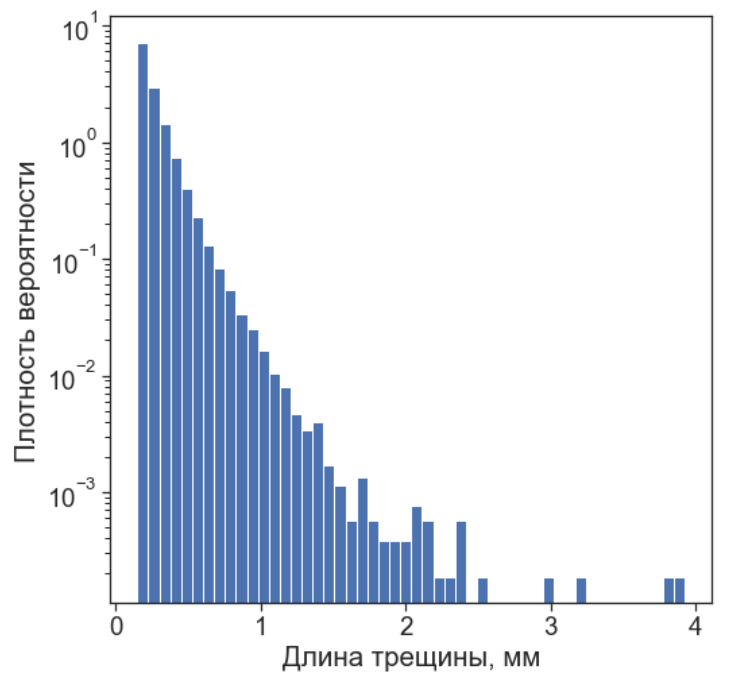

### Микроструктурный анализ образцов горных пород центральной части тектонического разлома

Дипломная работа на степень бакалавра МФТИ.
Работа подготовлена в Институте динамики геосфер РАН.


#### Цель работы
Выявление структурных особенностей пород, принадлежащих различным тектоническим типам, на основе статистического и топологического описания трещиноватых пород 

#### Поставленные задачи
- Формирование банка цифровых образов образцов горных пород
- Определение статистических характеристик микротрещиноватости
- Топологическое описание микротрещиноватости
- Выявление связи между статистическими и топологическими свойствами образцов


#### Методы

1) Получение геометрических характеристик трещин:

- Плотность трещин $P_{20} = N_L / S ~ [1/mm^2]$ 

- Длина трещины $l_i$

- Число пересечений трещин $N_i$

- Азимут трещины $\alpha_i$

2. Статистический анализ длин трещин

- Гипотеза о степенном, экспоненциальном, лог-нормальном распределении длин трещин
- Оценка максимального правдоподобия для каждого из распределений
- Выбор наилучшего распределения при помощи критерия отношения правдоподобия

3. Топологический анализ сети трещин

- Классификация вершин сети трещин на 3 типа: I, X, Y
- Нанесение пропорций количества вершин каждого типа на тернарную диаграмму 
- Выделение областей тернарной диаграммы, характерных для различных типов горных пород


#### Описание разработанного ПО


##### Формат входных данных

Цифровые образы шлифов представлены в формате .shp файлов, в которых трещины представлены как линеаменты. Каждый линеамент является объединением некоторого числа сегментов. В файлах хранятся координаты концов сегментов, а также информация о том, какие сегменты объединены в линеаменты.

Один .shp файл состоит из списка объектов(линеаментов), каждый из которых имеет следующую структуру: 
$[(x_1, y_1), ~(x_2, y_2), ~..., ~(x_n, y_n)]$,
где пары $(x_i, y_i), ~(x_{i+1}, y_{i+1})$ - начало и конец одного сегмента соответственно, $i=1, ..., n-1$


##### Структура репозитория

Для хранения всей необходимой информации о шлифе реализован класс ThinSection, находящийся в файле `thin_section_class.py`.

В папке `functions/` находятся модули, отвечающие за обработку .shp файла и вычисление различных характеристик шлифа, которые далее сохраняются как атрибуты класса ThinSection.


##### Создание экземпляра класса

Входными данными при создании экземпляра класса ThinSection являются путь до .shp файла, название шлифа и тектонический тип шлифа
```
from thin_section_class import ThinSection

name = '10-1а'  
tect_type = 'Катаклазит'  
path_to_shp = './shp_files/10-1а/all.shp'  

data = ThinSection(path_to_shp, name, tect_type)  # создание объекта
```

При создании экземпляра автоматически вычисляются базовые геометрические характеристики шлифа

После этого могут быть вызваны следующие методы:
- `perform_IXY_classification()` - для определения топологических характеристик
- `perform_stat_analysis()` - для проведения статистического анализа
- `calc_entropy()`, `calc_fractal_dimension()` - для вычисления энтропии и фрактаьлной размерности 

```
data.perform_IXY_classification(epsilon=5)
data.perform_stat_analysis()  
data.calc_entropy()
data.calc_fractal_dimension() 
```

Созданный объект сохраняется с помощью модуля `pickle`

```
name = data.name 
object_name = name + '_object'
path_to_pickle_files = './pickle_files/'
path_to_object = os.path.join(path_to_pickle_files, object_name) 
file = open(path_to_object, 'wb')
pickle.dump(data, file)
file.close()
```


Сохраненный файл в дальнейшем может быть открыт следующим образом

```
filename = '10-1а_object'
file = open(path_to_pickle_files + filename, 'rb')
data = pickle.load(file)
file.close()
```


##### Атрибуты класса

**Базовые характеристики шлифа**

```
# название шлифа, тектонический тип
data.name, data.tectonic_type
>>> ('10-1а', 'Катаклазит')

# общее количество трещин в шлифе
data.lineaments_sample_size
>>> 69984

# представление отдельной трещины (координаты начал и концов ее сегментов [x1, y1, x2, y2] в пикселях) 
data.lineaments_sample[0]
>>> array([[8348.49843587, -9264.20229406, 8335., -9284.],
           [8335., -9284., 8341., -9317.]])

# выборка длин трещин (мм)
data.lineaments_length_sample
>>> array([0.15042018, 0.17825434, 0.20978023, ...,
           0.15821945, 0.23427376, 0.2352493 ])

# выборка азимутов трещин (в градусах)
data.lineaments_azimuth_sample
>>> array([80.7066914 , 48.43363036, 79.90249562, ..., 
           21.80140949, 10.69651074,  2.51687566])

# двумерное распределение плотности трещин по шлифу
data.density_sample
>>> array([[40.43773852, 0., 0., ..., 0., 0., 0.],
           [0., 0., 0., ..., 0., 1., 0.],
           [0., 0., 0., ..., 0., 1., 0.],
           ...,
           [0., 0., 0., ..., 363.93964668, 67.39623087, 80.87547704],
           [0., 0., 0., ..., 390.89813902, 202.1886926, 242.62643112],
           [0., 0., 0., ..., 620.04532397, 768.31703187, 188.70944642]])

```

**Статистические характеристики шлифа**

Оценки максимального правдоподобия для степенного, экспоненциального и логнормального распределений

```
print('powerlaw alpha:', data.powerlaw_alpha_length)
print('exponential lambda:', data.exponential_lambda_length)
print('lognormal mu:', data.lognormal_mu_length)
print('lognormal sigma:', data.lognormal_sigma_length)

>>> powerlaw alpha: 3.121583706846542
    exponential lambda: 8.915528757340386
    lognormal mu: -2.383674113236403
    lognormal sigma: 0.7751351191536715
```

Результаты работы критерия отношения правдоподобия

```
# таблица с результатами работы критерия
data.stat_tests_lineaments_length
```


Энтропия и фрактальная размерность

```
# энтропия
data.entropy_rho_az
>>> 3.522592732906241

# фрактальная размерность
data.frac_dim
>>> 1.7621789638083856
```

**Топологические характеристики шлифа**

Число вершин типов X, I, Y
```
data.X_nodes, data.I_nodes, data.Y_nodes
>>> (157221, 77208, 83288)
```

Относительное число вершин X, I, Y:

$$\frac{N_X}{N}, ~ \frac{N_I}{N}, ~ \frac{N_Y}{N}, ~~ N = N_X + N_I + N_Y $$

```
data.XIY_counts_normed  # NX : NI : NY
>>> array([0.49484604, 0.24300872, 0.26214524])
```

#### Методы класса

Изображение оценок максимального правдоподобия

```
data.draw_length_MLE()
```


Карта плотности трещин
```
data.draw_density_histogram_2d()
```


Азимутальное распределение трещин
```
data.draw_rose_diagram_lineaments()
```


Распределение длин трещин
```
data.draw_trace_length_distribution()
```



#### Результаты и выводы

- Распределение длин трещин обработанных образцов, в основном, подчиняется лог-нормальному закону
- Статистический анализ длин трещин не позволяет сделать вывод о наличии структурных особенностей у образцов разных тектонических типов
- Область локализации образцов на тернарной диаграмме уширяется с увеличением степени преобразованности породы
- Локализация образца на тернарной диаграмме коррелирует с энтропией системы

Визуализация основных результатов работы представлена в файле `3_results.ipynb` 


#### Список используемых источников

##### Статьи

1) Ustinov, S., Ostapchuk, A., Svecherevskiy, A., Usachev, A., Gridin, G., Grigor’eva, A., & Nafigin, I. (2022). Prospects of geoinformatics in analyzing spatial heterogeneities of microstructural properties of a tectonic fault. Applied Sciences (Switzerland), 12(6) doi:10.3390/app12062864.

2) Sanderson, D. J., Nixon, C. W. (2015). The use of topology in fracture network characterization. Journal of Structural Geology, 72, 55-66. doi:10.1016/j.jsg.2015.01.005

3) Phillips, N. J., & Williams, R. T. (2021). To D or not to D? re-evaluating particle-size distributions in natural and experimental fault rocks. Earth and Planetary Science Letters, 553 doi:10.1016/j.epsl.2020.116635

4) Clauset, A., Shalizi, C. R., & Newman, M. E. J. (2009). Power-law distributions in empirical data. SIAM Review, 51(4), 661-703. doi:10.1137/070710111

5) Alstott, J., Bullmore, E., & Plenz, D. (2014). Powerlaw: A python package for analysis of heavy-tailed distributions. PLoS ONE, 9(1) doi:10.1371/journal.pone.0085777

6) Lei, Q., Latham, J. -., & Tsang, C. -. (2017). The use of discrete fracture networks for modelling coupled geomechanical and hydrological behaviour of fractured rocks. Computers and Geotechnics, 85, 151-176. doi:10.1016/j.compgeo.2016.12.024

7) Bonnet, E., Bour, O., Odling, N. E., Davy, P., Main, I., Cowie, P., & Berkowitz, B. (2001). Scaling of fracture systems in geological media. Reviews of Geophysics, 39(3), 347-383. doi:10.1029/1999RG000074  
  

##### Библиотеки

1) [The Python Shapefile Library (PyShp)](https://github.com/GeospatialPython/pyshp)

2) [powerlaw: A Python Package for Analysis of Heavy-Tailed Distributions](https://github.com/jeffalstott/powerlaw)

1) [Marc Harper et al. (2015). python-ternary: Ternary Plots in Python. Zenodo. 10.5281/zenodo.594435](https://github.com/marcharper/python-ternary)